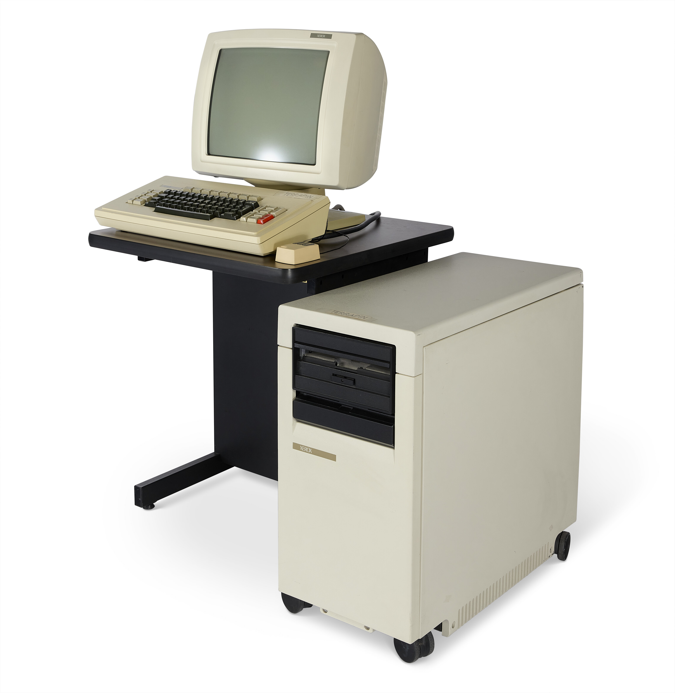

# FauxStar

This repository *will contain* the instructions for building a NN% scale Faux [Xerox Star Computer](https://en.wikipedia.org/wiki/Xerox_Star). I'm still in the process of getting accurate dimensions, making choices about scale, and thinking about the overall structure. In the mean time I've been assembling various bits of software so that the FauxStar will be able to emulate some of the classic Xerox environments.

[](images/XeroxDandelionFront.jpg)
[](images/XeroxDandelionOblique.jpg)

In particular, I will be modeling the Xerox 8010 computer, otherwise known as the Dandelion. This hardware was also sold as the Xerox 1108 Scientific Information Processor (a Lisp machine). This machine is special to me since it became my daily driver at Xerox when I worked in the [Pilot Operating System](https://en.wikipedia.org/wiki/Pilot_(operating_system)) group. Having said that, some of the software that I am assembling is actually meant to run on slightly newer versions of the hardware like the [Xerox 6085 (Daybreak)](https://en.wikipedia.org/wiki/Xerox_Daybreak). I'm going to live with this anachronism since the machine I want to see on the shelf is a Dandelion.

The rest of the documentation is split into the following parts in the order you'll want to go through them.

* [The Model](FauxStar_model.md): Instructions on how to print and assemble the model and electronic components, including a Raspberry Pi.
* [Basic Software Installation](): In this section, which is just a little further down in this file, you'll be given the steps to prepare your Raspberry Pi and download the emulators. There are more steps covered in the Mesa and Smalltalk sections. 
* [The Mesa World](FauxStar_Mesa.md):
	* This sections discusses to install and use the Mesa emulator on *FauxStar*. Doing this provides access to the [Xerox Development Environment (XDE)](https://web.archive.org/web/20041204132344/http://www.apearson.f2s.com/xde.html), and [Star](https://en.wikipedia.org/wiki/Xerox_Star#User_interface)/[Viewpoint/GlobalView](https://en.wikipedia.org/wiki/GlobalView)
	* The emulator I'm using is a fork of the wonderful [Dwarf emulator for the Xerox 6085](https://github.com/devhawala/dwarf) by [@devhawala](https://github.com/devhawala) 
* [The Smalltalk-80 World](FauxStar_ST80.md):
	* This section discusses how to install and use the Smalltalk-80 emulator on *FauxStar*
	* The emulator I'm using is also from [@devhawala](https://github.com/devhawala) and is named ST80. We will also be using a fork of this with minor changes. 

## Software Setup

Follow the steps below to get your RPi configured and the emulators downloaded. There are futher steps you'll need to follow that are specific to the Mesa and Smalltalk emulators respectively.

* **Prepare Raspberry Pi OS**. Create an image of the Raspberry Pi OS that is appropriate for your Pi. Don't use the Lite version - you'll need the window system installed. I used the latest OS release as of September 2024, Bookworm. Boot the OS and customize as you like.
* **Install the emulators**: Use the commands below to download and install the Mesa and Smalltalk emulators. They can be installed into any directory you like. In the commands below, it is assumed that you have navigated (`cd`) to that directory.

```
mkdir fauxstar
cd fauxstar
curl -L -o FauxStar-main.zip https://github.com/jpasqua/FauxStar/archive/refs/heads/main.zip
unzip FauxStar-main.zip
rm FauxStar-main.zip
mv FauxStar-main/mesa/ .
mv FauxStar-main/st80/ .
rm -rf FauxStar-main/
cd mesa
# Get the dwarf emulator from the jpasqua fork of dwarf
curl -L -o dwarf.jar https://raw.githubusercontent.com/jpasqua/dwarf/master/dwarf.jar
cd ../st80
curl -L -o st80vm.jar https://raw.githubusercontent.com/jpasqua/ST80/master/st80vm.jar
```

Once you've executed these commands you are ready to prepare the [Mesa](FauxStar_Mesa.md) and [Smalltalk](FauxStar_ST80.md) worlds.

## License: [![CC BY-NC 4.0][cc-by-nc-shield]][cc-by-nc]

The license for Dwarf can be found at the [Dwarf repo](https://github.com/devhawala/dwarf).

This work is licensed under a
[Creative Commons Attribution-NonCommercial 4.0 International License][cc-by-nc].

[![CC BY-NC 4.0][cc-by-nc-image]][cc-by-nc]

[cc-by-nc]: https://creativecommons.org/licenses/by-nc/4.0/
[cc-by-nc-image]: https://licensebuttons.net/l/by-nc/4.0/88x31.png
[cc-by-nc-shield]: https://img.shields.io/badge/License-CC%20BY--NC%204.0-lightgrey.svg

