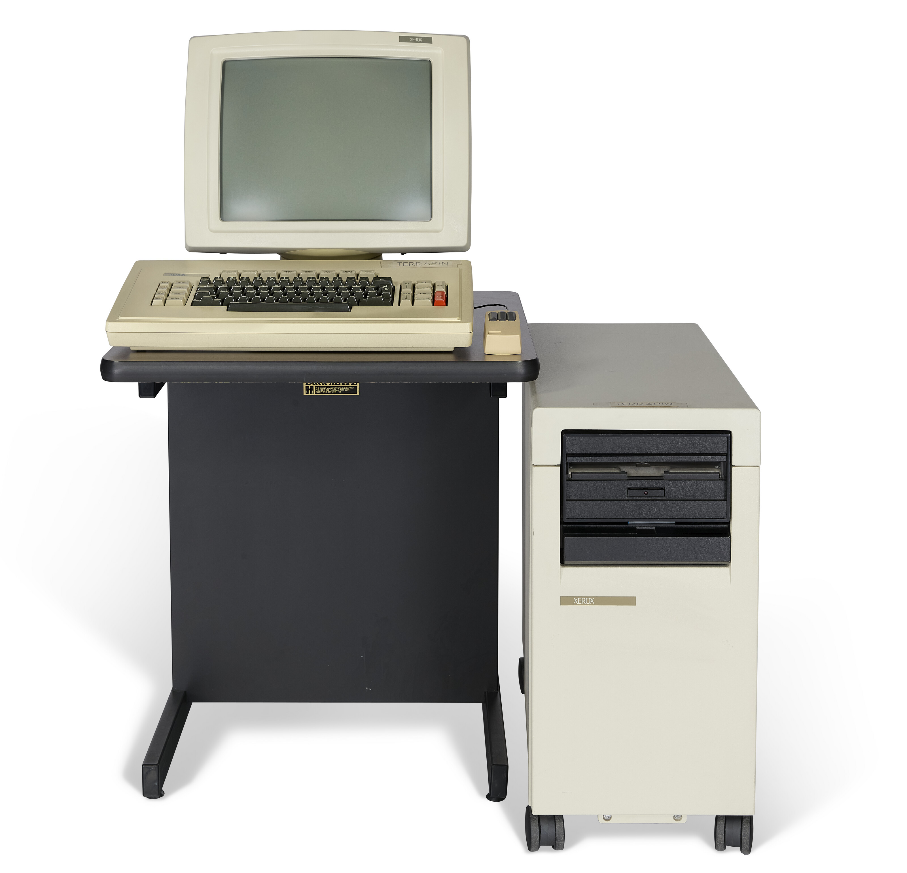
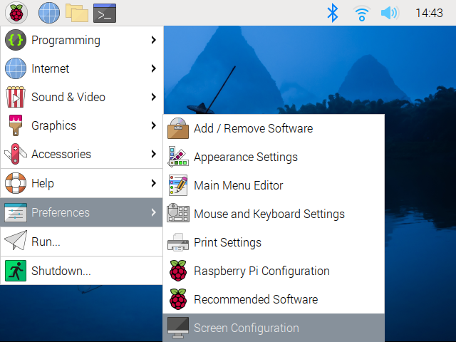

# FauxStar

This repository *will contain* the instructions for building a NN% scale Faux [Xerox Star Computer](https://en.wikipedia.org/wiki/Xerox_Star). I'm still in the process of getting accurate dimensions, making choices about scale, and thinking about the overall structure. In the mean time I've been assembling various bits of software so that the FauxStar will be able to emulate some of the classic Xerox environments.

[](images/XeroxDandelionFront.jpg)
[](images/XeroxDandelionOblique.jpg)

In particular, I will be modeling the Xerox 8010 computer, otherwise known as the Dandelion. This hardware was also sold as the Xerox 1108 Scientific Information Processor (a Lisp machine). This machine is special to me since it became my daily driver at Xerox when I worked in the [Pilot Operating System](https://en.wikipedia.org/wiki/Pilot_(operating_system)) group. Having said that, some of the software that I am assembling is actually meant to run on slightly newer versions of the hardware like the [Xerox 6085 (Daybreak)](https://en.wikipedia.org/wiki/Xerox_Daybreak). I'm going to live with this anachronism since the machine I want to see on the shelf is a Dandelion.

The rest of the documentation is split into the following parts in the order you'll want to go through them.

* [The Model](FauxStar_model.md): Instructions on how to print and assemble the model and electronic components, including a Raspberry Pi.
* [Basic Software Installation](): In this section, which is just a little further down the page, you'll be given the steps to prepare your Raspberry Pi and install the emulators. 
* [The Mesa World](FauxStar_Mesa.md):
	* This sections discusses how to use the Mesa emulator, which provides access to the [Xerox Development Environment (XDE)](https://web.archive.org/web/20041204132344/http://www.apearson.f2s.com/xde.html), and [Star](https://en.wikipedia.org/wiki/Xerox_Star#User_interface)/[Viewpoint/GlobalView](https://en.wikipedia.org/wiki/GlobalView)
	* There are notes on how to run the emulator directly, but normally it can be invoked via the general `fauxstar.sh` script.
	* The emulator I'm using is a fork of the wonderful [Dwarf emulator for the Xerox 6085](https://github.com/devhawala/dwarf) by [@devhawala](https://github.com/devhawala) 
* [The Smalltalk-80 World](FauxStar_ST80.md):
	* This section discusses how to use the Smalltalk-80 emulator on *FauxStar*.
	* There are notes on how to run the emulator directly, but normally it can be invoked via the general `fauxstar.sh` script.
	* The emulator I'm using is also from [@devhawala](https://github.com/devhawala) and is named ST80. We will also be using a fork of this with minor changes. 
* [The Lisp World](FauxStar_Lisp.md):
	* This section discusses how to use the Medley Interlisp emulator on *FauxStar*.
	* There are notes on how to run the emulator directly, but normally it can be invoked via the general `fauxstar.sh` script.
	* The emulator I'm using is also from [The Medley Interlisp Project](https://interlisp.org). Here is the [GitHub repo](https://github.com/Interlisp/medley).
	* At the moment the installation script only runs on the Raspberry Pi, though you can install Medley manually using instructions from their repo.

## Software Setup

Follow the steps below to get your RPi configured and the emulators downloaded.

***Limitations***: *FauxStar* is targeted to the Raspberry Pi. All the unedrlying emulators work wonderfull on the Pi as well as Mac and Windows, but as this project focuses on the replica model, I've only targeted the scripts for the Pi.

* **Prepare Raspberry Pi OS**. Create an image of the Raspberry Pi OS that is appropriate for your Pi. Don't use the Lite version - you'll need the window system installed. I used the latest OS release as of September 2024, Bookworm. Boot the OS and customize as you like.
* **Preparing the Display**
	* **Adjust Screen Settings**: The display board comes with a control board with several buttons. The boards are connected to one another through a fairly flat 6-wire cable. You won't be using the control board in normal operation, but you may wish to connect it during initial setup to adjust things like input source, brightness, etc. After that you can remove the control board and cable and only reattach it if needed.
	* **Flip the display orientation**. Because of the placement of ports on the display, it must be mounted upside down in the case. This means that the display orientation needs to be flipped 180&deg;. This is accomplished using the Screen Preferences in the Raspberry Pi desktop. Selected the inverted option.

		[](images/SW/ScrPrefs.png)
		[](images/SW/Inverted.png)

  		Once you've done this, the Window System will display properly. Note, however, that as the Pi is booting, everything will appear upside down until the window system launches.
	* **Add Resolutions** (Optional). By default the 5" display and associated display board will default to 640x480 (the native resolution) and allow you to switch the resolution to 720x400. However, the board will actually support resolutions up to 1920x1080. Of course the screen is completely at that resolution. It can be advantageous for some demo purposes to be able to use the higher resolutions to give the overall feel of the machine without being able to easily read the detailed text. Doing so isn't hard, but you need to be precise in the following steps.
	
		```
		cd ~
		curl -L -o multi-edid.bin https://raw.githubusercontent.com/jpasqua/FauxStar/main/resources/multi-edid.bin
		sudo cp multi-edid.bin /lib/firmware/
		sudo sed -i -e '$ s/$/ drm.edid_firmware=HDMI-A-1:multi-edid.bin/' /boot/firmware/cmdline.txt
		```
		
		This places a custom [EDID](https://en.wikipedia.org/wiki/Extended_Display_Identification_Data) in the `/lib/firmware` folder and tells the system to refer to it when booting. This EDID tells the system that many other resolutions are available. It will default to 1024x768, so you'll need to use a tool like Screen Preferences to set it to 640x480 or other resolutions.

* **Activity LED**: The floppy drive of *FauxStar* has an activity LED. You can configure the software so that the status of that LED corresponds to the Pi's activity LED. To do this you need to add a line to the end of the Pi's `config.txt` file (`/boot/firmware/config.txt`):

	```
	dtoverlay=act-led,gpio=17
	```
	After the next reboot, the floppy led will mirror the PI's activity LED. This is also useful when you are shutting down your system to know when it is ok to turn the power off.

* **Install the emulators**: Use the commands below to download core files and launch the *FauxStar* installation process. *FauxStar* can be installed into any directory you like. Navigate (`cd`) to that directory before executing the following commands. You will be asked which of the available emulators you want to install (mesa, smalltalk-80, lisp). Choose at least one.

	```
	mkdir fauxstar ; cd fauxstar
	curl -L -o FauxStar-main.zip https://github.com/jpasqua/FauxStar/archive/refs/heads/main.zip
	unzip FauxStar-main.zip ; rm FauxStar-main.zip
	FauxStar-main/install.sh
	```

## Running the Emulator(s)

To run any of the available emulators invoke the `fauxstar.sh` script. For example, if you are already in the `fauxstar` directory, type:

```
./fauxstar.sh
```

Doing so will provide a list of available emulators. You'll be asked to choose one and then you will be given a menu of options that are specific to that emulator. If you use the `-h` option you'll be given a usage message:

```
Usage: ./fauxstar.sh [mesa|st80|lisp] [additional_parameters]
  * If you provide no arguments you will be asked to choose an emulation
    type and then be given a menu of options specific to that emulator.
  * If you provide only the emulation type, you will be presented with
    a menu of options specific to that emulation
  * If you provide an emulation type and additional parameters, the
    chosen emulator will be run with those options and no additional
    input is requested
```

For more detailed information about how to run the emulators, see the documentation for [Mesa](FauxStar_Mesa.md#usage), [Smalltalk-80](FauxStar_ST80.md#usage), and [Lisp](FauxStar_Lisp.md#usage)


## License: [![CC BY-NC 4.0][cc-by-nc-shield]][cc-by-nc]

The license for Dwarf can be found at the [Dwarf repo](https://github.com/devhawala/dwarf).
The license for ST80 can be found at the [ST80 repo](https://github.com/devhawala/ST80).

This work is licensed under a
[Creative Commons Attribution-NonCommercial 4.0 International License][cc-by-nc].

[![CC BY-NC 4.0][cc-by-nc-image]][cc-by-nc]

[cc-by-nc]: https://creativecommons.org/licenses/by-nc/4.0/
[cc-by-nc-image]: https://licensebuttons.net/l/by-nc/4.0/88x31.png
[cc-by-nc-shield]: https://img.shields.io/badge/License-CC%20BY--NC%204.0-lightgrey.svg

